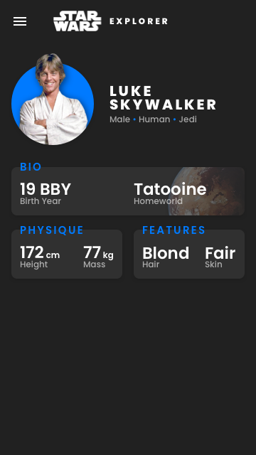

# REDspace Angular Frontend Code Challenge (Star Wars Explorer)

A simple Angular app that displays data from the [Star Wars API](https://swapi.dev/).

Check out a live demo on my [website](https://joannab.ca/star-wars-explorer/)!

## Development server

1. Download `star-wars-explorer`.
2. Open your favourite terminal emulator.
3. Navigate to `star-wars-explorer`, ie `cd Downloads/star-wars-explorer/`.
4. Run `ng serve -o` for a dev server that will open in your default web browser.

## Mobile-size mockup for later revisions

Made in Sketch.

### Other notes

This project was generated with [Angular CLI](https://github.com/angular/angular-cli) version 11.1.0.

###### Copyright notes

Star Wars and all associated names, logos, and images are property of Lucasfilm Limited.

This project is in no way affiliated with or endorsed by Lucasfilm Limited.

###### Mockup Attributions

Image of Star Wars logo taken from [Wikipedia](https://en.wikipedia.org/wiki/Star_Wars#/media/File:Star_wars2.svg).

Image of Luke Skywalker taken from [pngfind](https://www.pngfind.com/mpng/hTmiJx_luke-skywalker-transparent-transparent-background-luke-skywalker-transparent/).

Image of Tatooine taken from [Wookiepedia](https://starwars.fandom.com/wiki/Tatooine?file=Tatooine_TPM.png).
